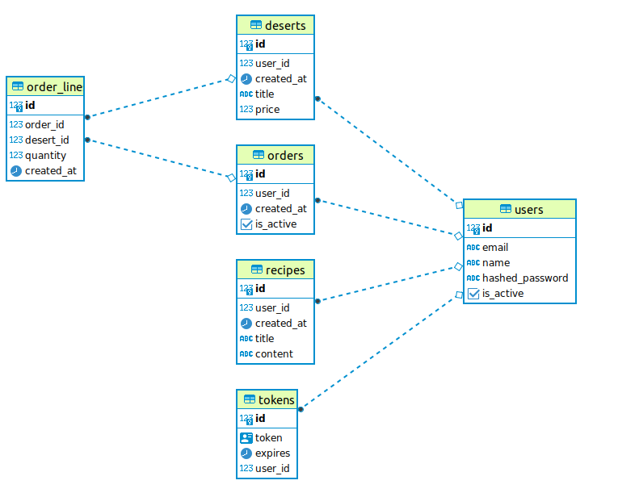

# Desert and Recepies

Desert and Recepies - backend-сервис на основе `FastAPI`, предлагающий пользователям возможномть хранить рецепты любимых сладостей и обмениваться ими с другими пользователями. Также сервис позволяет искать и заказвать десерты. Авторизация - `JWT`. База данных - `PostgreSQL`. Миграции - `Alembic`. ORM - `SQLAlchemy`. Валидация - `Pydantic`. Зависимости - `Poetry`.   

## Описание схемы БД

База данных содержит 6 моделей: `Пользователь`, `Токен`, `Рецепт`, `Десерт`, `Заказ`, `Строчка заказа`. Ниже представлена графическая схема моделей и их взаимосвязей.



## Краткая документация API

Работа с моделями БД осуществляется по следующим эндпоинтам: 

Method | HTTP request | Description
------------- | ------------- | -------------
[**create_new_user**] | **POST** /sign-up | Регистрация нового пользователя
[**get_user_by_email**] | **POST** /auth |  Авторизация пользователя.
[**get_current_user**] | **GET** /users/me | Извлечение текущего пользователя.
[**create_recipe**] | **POST** /recipes | Добавление нового рецепта.
[**read_my_recipes**] | **GET** /my_recipes | Извлечение рецептов текущего пользователя.
[**read_recipe_by_id**] | **GET** /recipes/{recipe_id} | Извлечение рецепта по `ID`.
[**update_recipe_by_id**] | **PUT** /recipes/{recipe_id} | Редактирование рецепта пользователя по `ID`.
[**read_deserts**] | **GET** /deserts/ | Извлечение списка всех десертов.
[**create_desert**] | **POST** /deserts/ | Добавление нового десерта.
[**read_desert_by_id**] | **GET** /deserts/{desert_id} |  Извлечение десерта по `ID`.
[**update_desert_by_id**] | **PUT** /deserts/{desert_id} | Редактирование десерта пользователя по `ID`.
[**create_order**] | **POST** /my_orders/ | Создание заказа.
[**read_my orders**] | **GET** /my_orders/ | Извлечение списка всех заказов текущего пользователя.
[**read_order_by_id**] | **GET** /my_orders/{order_id} |  Извлечение заказа по `ID`.
[**add_desert_to order**] | **POST** /my_orders/ | Добавление десерта в заказ.


Исчерпывающую информацию по работе API можно получить после запуска по адресу http://127.0.0.1:8000/
Документация на основе Swagger, в соответствии со стандартом OpenAPI.

## Инструкция по установке для среды Windows или OS (используйте терминал)

1. Клонируете репозиторий:
```sh
git clone https://github.com/XanderMoroz/recepies_restapi.git
```
2. Устанавливаете, виртуальное окружение:
```sh
poetry shell
```
3. Устанавливаете зависимости проекта:
```sh
poetry install
```
4. Запускаете API:
```sh
uvicorn app.main:app --reload
```
5. Переходите на страницу документации по адресу: 
```sh
http://127.0.0.1:8000/
```
6. Сервис готов к эксплуатации.
